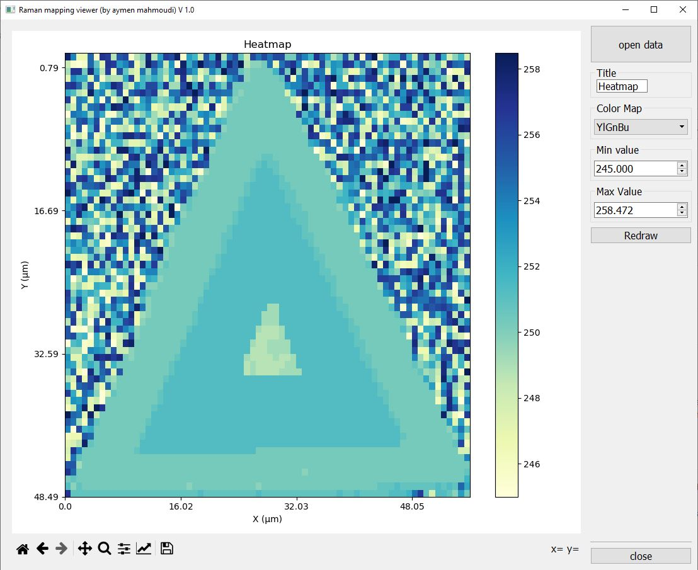

# Raman mapping viewer

## Description
Labspec software as far as I know still has a bug when saving mapping data under raster images in high quality export. Nevertheless, it is always possible to save the table of data under txt format. Via this project, I created a solution to open this mapping data under diffrent tunable color map. 
A visual interface as well as a notebook file solution are available to a direct use.

 
 

The graphical interface allows a direct presentation of the map data after a loading of the txt file. The first notebook allows a plotting of the mapping in normal or binary mode. The second one allows to combine two maps by perform arithmetic operations. This can very useful to highlight the wanted information vis-à-vis the contribtion of different peaks.

## Usage
The usage of the graphical interface as well as the notebook files is super user friendly, you have to choose the map color you prefer, tune the maximum and minimum values and click Redraw to apply changes.
 
To use the app, you can download and directly execute the file Raman_viewer.exe (just for Windows X64). Otherwise, you can run the main.py script which is available within the necessary resources (I recommend the setup of python 3.8 python virtual environment). 

## Support
In case of problem, It is strongly recommended to post an issue. For a more confidential demand, you can email to mahmoudi7050@gmail.com

## Contributing
Don't hesitate if you have any suggestions/ideas to enhance those scripts. I am open to all kind of contributions.